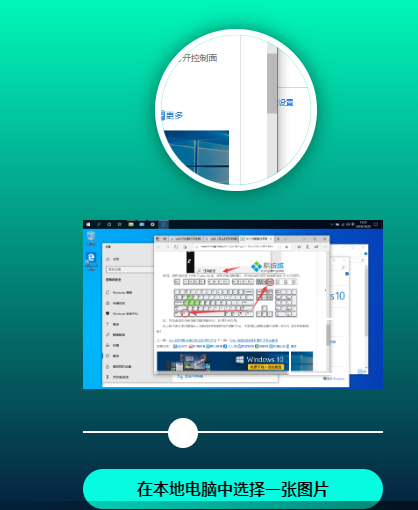

# 图像剪切器-缩放剪切

### `JavaScript`

```javascript
//all handwritten vanilla JS. Could possibly be optimized, especially the selection-resizing stuff ..
const fileselect = document.getElementById("fileselect");
const fileselectlabel = document.getElementById("fileselectlabel");
const image = document.getElementById("image");
const selection = document.getElementById("selection");
let sel_width = selection.offsetWidth;
let sel_height = selection.offsetHeight;
const resize = document.getElementById("resize");

//Filereader
fileselect.addEventListener("change", e => {
	image.style.display = "inline";
	selection.style.display = "inline";
	const selectedFile = fileselect.files[0];

	let reader = new FileReader();
	reader.onload = function(event) {
		image.src = event.target.result;
	};
	reader.addEventListener("loadend", e => {
		let maxVal = getMaxSize();
		resize.max = maxVal;
		resize.value = maxVal;
		selection.style.width = maxVal - 4 + "px";
		selection.style.height = maxVal - 4 + "px";
		selection.style.left = image.offsetLeft + "px";
		selection.style.top = image.offsetTop + "px";
		draw();
	});
	reader.readAsDataURL(selectedFile);
});

//Resize Selection
resize.addEventListener("input", e => {
	console.log("oiiii");
	console.log(resize.max, resize.value);
	setSelectionSize(resize.value);
});

//Set selection size
function setSelectionSize(size) {
	let space = 0;

	let maxHorR =
		image.offsetLeft +
		image.offsetWidth -
		(selection.offsetLeft + selection.offsetWidth);
	let maxVerB =
		image.offsetTop +
		image.offsetHeight -
		(selection.offsetTop + selection.offsetHeight);
	let maxHorL = (image.offsetLeft - selection.offsetLeft) * -1;
	let maxVerT = (image.offsetTop - selection.offsetTop) * -1;

	space = Math.min(maxHorR, maxVerB, maxHorL, maxVerT) - 2;

	//expand AROUND as long as there is space
	if (
		size <= selection.offsetWidth + space &&
		size <= selection.offsetHeight + space
	) {
		let dx = selection.offsetWidth - 4 - size;
		let dy = selection.offsetHeight - 4 - size;

		selection.style.left = selection.offsetLeft + dx / 2 + "px";
		selection.style.top = selection.offsetTop + dy / 2 + "px";

		selection.style.width = size + "px";
		selection.style.height = size + "px";
		draw();
	} else {
		//expand RIGHT and DOWN as long as possible after that
		if (maxHorR > 0 && maxVerB > 0) {
			let limit = Math.min(maxHorR, maxVerB) - 2;
			if (
				size <= selection.offsetWidth + limit &&
				size <= selection.offsetHeight + limit
			) {
				selection.style.width = size + "px";
				selection.style.height = size + "px";
				draw();
			}
		}

		//expand LEFT and UP as long as possible after that
		if (maxHorL > 0 && maxVerT > 0) {
			let limitLT = Math.min(maxHorL, maxVerT) - 2;
			if (
				size <= selection.offsetWidth + limitLT &&
				size <= selection.offsetHeight + limitLT
			) {
				let dx = selection.offsetWidth - 4 - size;
				let dy = selection.offsetHeight - 4 - size;
				selection.style.left = selection.offsetLeft + dx + "px";
				selection.style.top = selection.offsetTop + dy + "px";
				selection.style.width = size + "px";
				selection.style.height = size + "px";
				draw();
			}
		}

		//expand RIGHT and UP as long as possible after that
		if (maxHorR > 0 && maxVerT > 0 && maxHorL < 1 && maxVerB < 1) {
			let limitRT = Math.min(maxHorR, maxVerT) - 2;
			if (
				size <= selection.offsetWidth + limitRT &&
				size <= selection.offsetHeight + limitRT
			) {
				let dy = selection.offsetHeight - 4 - size;
				selection.style.top = selection.offsetTop + dy + "px";
				selection.style.width = size + "px";
				selection.style.height = size + "px";
				draw();
			}
		}

		//expand LEFT and DOWN as long as possible after that
		if (maxHorL > 0 || maxVerB > 0) {
			let limitLB = Math.min(maxHorL, maxVerB) - 2;
			if (
				size <= selection.offsetWidth + limitLB &&
				size <= selection.offsetHeight + limitLB
			) {
				let dx = selection.offsetWidth - 4 - size;
				selection.style.left = selection.offsetLeft + dx + "px";
				selection.style.width = size + "px";
				selection.style.height = size + "px";
				draw();
			}
		}
	}
}

//Move Selection
let clicked = false;
let resClicked = false;
let selDefWidth = selection.offsetWidth;
let selDefHeight = selection.offsetHeight;

let startX = 0;
let startY = 0;
let t_startX = 0;
let t_startY = 0;

selection.addEventListener("mousedown", e => {
	console.log("oi");
	clicked = true;
	selection.style.cursor = "move";
});

selection.addEventListener("mousemove", e => {
	if (clicked && resClicked === false) {
		console.log(e.clientX);
		console.log(e.movementX);

		startX = selection.offsetLeft;
		startY = selection.offsetTop;

		let xpos = startX + e.movementX;
		let ypos = startY + e.movementY;
		setSel(xpos, ypos);
	}
});

selection.addEventListener("mouseup", e => {
	clicked = false;
	selection.style.cursor = "pointer";
});

selection.addEventListener("mouseleave", e => {
	clicked = false;
	selection.style.cursor = "pointer";
});

selection.addEventListener("touchstart", e => {
	console.log("touch");
	clicked = true;
	let touchobj = e.changedTouches[0];
	t_startX = touchobj.pageX;
	t_startY = touchobj.pageY;
});

selection.addEventListener("touchmove", e => {
	e.preventDefault();
	if (clicked && resClicked === false) {
		startX = selection.offsetLeft;
		startY = selection.offsetTop;

		let touchobj = e.changedTouches[0];
		let divX = touchobj.pageX - t_startX;
		let divY = touchobj.pageY - t_startY;
		console.log(divX);
		console.log(divY);

		let xpos = startX + divX;
		let ypos = startY + divY;
		setSel(xpos, ypos);

		t_startX = touchobj.pageX;
		t_startY = touchobj.pageY;
	}
});

selection.addEventListener("touchend", e => {
	clicked = false;
});

//set selection position
function setSel(x, y) {
	if (x >= image.offsetLeft) {
		if (x <= image.offsetLeft + image.offsetWidth - selection.offsetWidth) {
			selection.style.left = x + "px";
		}
	}
	if (y >= image.offsetTop) {
		if (y <= image.offsetTop + image.offsetHeight - selection.offsetHeight) {
			selection.style.top = y + "px";
		}
	}
	draw();
	getMaxSpace();
}

//Get the selection and draw canvas
function draw() {
	let xFactor = image.naturalWidth / image.offsetWidth;
	let yFactor = image.naturalHeight / image.offsetHeight;
	console.log(xFactor, yFactor);

	let canvas = document.getElementById("myca");
	let ctx = canvas.getContext("2d");

	// Draw slice
	let sx = (selection.offsetLeft - image.offsetLeft) * xFactor;
	let sy = (selection.offsetTop - image.offsetTop) * yFactor;
	let sWidth = selection.offsetWidth * xFactor;
	let sHeight = selection.offsetHeight * yFactor;
	let dx = 0;
	let dy = 0;
	let dWidth = canvas.offsetWidth * 4;
	let dHeight = canvas.offsetHeight * 4;

	ctx.drawImage(image, sx, sy, sWidth, sHeight, dx, dy, dWidth, dHeight);
}

//Get lenght of shorter side
function getMaxSize() {
	let maxSize = 0;
	if (image.offsetHeight < image.offsetWidth) {
		maxSize = image.offsetHeight;
	} else {
		maxSize = image.offsetWidth;
	}
	return maxSize;
}

//Determine how large the selection box can get
function getMaxSpace() {
	let maxSpace = 0;
	let maxHor =
		image.offsetLeft +
		image.offsetWidth -
		(selection.offsetLeft + selection.offsetWidth);
	let maxVer =
		image.offsetTop +
		image.offsetHeight -
		(selection.offsetTop + selection.offsetHeight);

	let maxHorL = (image.offsetLeft - selection.offsetLeft) * -1;
	let maxVerT = (image.offsetTop - selection.offsetTop) * -1;

	maxSpace = Math.min(maxHor, maxVer, maxHorL, maxVerT) - 2;
	return maxSpace;
}

//prevent scrolling on iOS, but allow touchmove on slider 
let letTouchMove = false;
const bg = document.getElementById("bg");
bg.addEventListener("touchmove", e => {
	if (letTouchMove === false) {
		e.preventDefault();
	}
});
resize.addEventListener("touchstart", e => {
	letTouchMove = true;
});
resize.addEventListener("touchend", e => {
	letTouchMove = false;
});
```

### `CSS`

```CSS
/* Minimally useful use of variables... */
:root{
	--okcolor: #05fce0;
	--fontfam: sans-serif;
}
body {
	border: none;
	margin: 0;
	padding: 0;
	border-radius: 0;
	-webkit-appearance: none;
	-moz-appearance: none;	
}

#bg{
	position: absolute;
	top: 0;
	bottom: 0;
	left: 0;
	right: 0;	
	background: rgb(0,255,191);
	background: linear-gradient(180deg, rgba(0,255,191,1) 0%, rgba(5,23,56,1) 100%);
}

#container {
	position: absolute;
	top: 0;
	bottom: 0;
	left: 50%;
	transform: translate(-50%, 0%);
	width: 320px;
}

#fileselectlabel{
	position: absolute;
	left: 10px;
	bottom: 30px;
	width: 300px;
	height: 40px;
	border-radius: 20px;
	font-family: var(--fontfam);
	font-weight: bold;
	background: var(--okcolor);	
	text-align: center;
	line-height: 40px;
	cursor: pointer;
}

#fileselect {
	position: absolute;
	left: 20px;
	top: 20px;
	display: none;
}

#image {
	position: absolute;
	left: 10px;
	bottom: 150px;
	width: 300px;
	min-height: 50px;
	-webkit-user-select: none;
	-moz-user-select: none;
	-ms-user-select: none;
	user-select: none;
	display: none;
}

#selection {
	position: absolute;
	left: 10px;
	bottom: 150px;
	width: 100px;
	height: 100px;
	border-radius: 0px;
	background: none;
	border: 2px solid #fff;
	cursor: pointer;
	display: none;*/
}

#myca {
	position: absolute;
	left: 82px;
	top: 50px;
	border-radius: 50%;
	box-shadow:  0vh 0vh 20px rgba(0, 0, 0, 0.5);
	border: 6px solid #fff;
	height: 150px;
	width: 150px;
}

/*Slider Sylez*/
.sliderblock {
	position: absolute;
	left: 0px;
	bottom: 80px;
	height: 50px;
	width: 320px;
	padding: 0;
}
#resize {
	position: absolute;
	top: 10px;
	left: 8px;
	width: 300px;
}
#resizelabel{
	visibility: hidden;
}

/* Styling the sliders*/
input[type="range"] {
	-webkit-appearance: none;
	background: transparent;
}
input[type="range"]::-webkit-slider-thumb {
	-webkit-appearance: none;
}
input[type="range"]:focus {
	outline: none;
}
input[type="range"]::-ms-track {
	cursor: pointer;
	background: transparent;
	border-color: transparent;
	color: transparent;
}

/*New range styles*/
input[type="range"]::-webkit-slider-runnable-track {
	height: 2px;
	cursor: pointer;
	background: #fff;
	margin-top: 10px;
}

input[type="range"]::-webkit-slider-thumb {
	height: 30px;
	width: 30px;
	border-radius: 15px;
	background: #fff;
	cursor: pointer;
	-webkit-appearance: none;
	margin-top: -13px;
}


input[type="range"]::-moz-range-track {
	width: 100%;
	height: 2px;
	cursor: pointer;
	background: #fff;
}
input[type="range"]::-moz-range-thumb {
	height: 30px;
	width: 30px;
	border-radius: 20px;
	background: #fff;
	cursor: pointer;
	-webkit-appearance: none;
	margin-top: -13px;
}


input[type="range"]::-ms-track {
	width: 100%;
	height: 2px;
	cursor: pointer;
	background: #fff;
}

input[type="range"]::-ms-thumb {
	height: 30px;
	width: 30px;
	border-radius: 20px;
	background: #fff;
	cursor: pointer;
	-webkit-appearance: none;
	margin-top: 0px;
}
```

### `HTML`

```html
<!--- 选择图片... -->
<link rel="stylesheet" href="https://maxcdn.bootstrapcdn.com/font-awesome/4.7.0/css/font-awesome.min.css">
  
<div id="bg">
<div id="container">
	<label id="fileselectlabel" for="fileselect">在本地电脑中选择一张图片</label>
	<input type="file" id="fileselect" name="profile_image" accept=".jpg, .jpeg, .png">
	</img>
	<div id="selection"></div>
	<div class="sliderblock">
		<input class="slider" id="resize" type="range" min="0" max="500" value="100">
		<label id="resizelabel" for="resize">resize selection</label>
	</div>
	<canvas id="myca" width="600" height="600"></canvas>
</div>
</div>
```

### 效果

