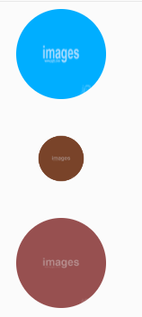

# 图片呼吸效果

### `CSS`

```css
 img {
	width:100px;
	height:100px;
	border-radius:50%;
	margin:0 20px;
	opacity:0.5
        /*x,y值，*/
         transition:all 1s;
	-webkit-transition:all 1s;
	-o-transition:all 1s;
}
p:hover img {
	transform:scale(0.5,0.5);
	-webkit-transform:scale(0.5,0.5);
	-o-transform:scale(0.5,0.5);
	/*对前效果的过度*/
        opacity:1;
	z-index:1
}

```

### `HTML`

```html
<div>
    <p></p>
    <p></p>
    <p></p>
    <p></p>
</div>
```

### 效果

