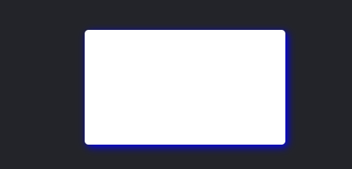

# 实现拖动效果

### `javaScript`

```javascript
function dragFunc(id) {
    //此处可以通过document.getElementByClassName(id)[0]来获取
    var Drag = document.getElementById(id);
    
    Drag.onmousedown = function(event) {
        var ev = event || window.event;
        event.stopPropagation();
        var disX = ev.clientX - Drag.offsetLeft;
        var disY = ev.clientY - Drag.offsetTop;
        document.onmousemove = function(event) {
            var ev = event || window.event;
            Drag.style.left = ev.clientX - disX + "px";
            Drag.style.top = ev.clientY - disY + "px";
            Drag.style.cursor = "move";
        };
    };
    Drag.onmouseup = function() {
        document.onmousemove = null;
        this.style.cursor = "default";
    };
};
dragFunc("idOuterDiv");
```

### `CSS`

```css
body {
	background-color:#232429;
}
.CsOuterDiv {
	width:256px;
	height:146px;
	background-color:white;
	position:absolute;
	top:50%;
	left:50%;
	transform:translateX(-50%) translateY(-50%);
	-moz-transform:translateX(-50%) translateY(-50%);
	-webkit-transform:translateX(-50%) translateY(-50%);
	-ms-transform:translateX(-50%) translateY(-50%);
	border-radius:5px;
	box-shadow:3px 3px  10px blue;
}

```

### `HTML`

```html
<div id="idOuterDiv" class="CsOuterDiv">

</div>
```

### 效果

