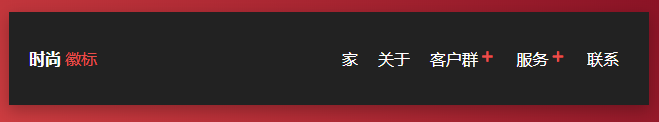
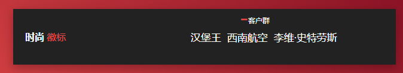

# 导航菜单栏-移动效果

### `JavaScript`

```javascript
var clients = document.getElementById('clients');
var services = document.getElementById('services');

clients.addEventListener('click', function() {
  $(clients).toggleClass("active");
  $(".parent:not(#clients)").toggleClass("invisible");
}, false);

services.addEventListener('click', function() {
  $(services).toggleClass("active");
  $(".parent:not(#services)").toggleClass("invisible");
}, false);
```

### `CSS`

```css
body {
  font-family: "Roboto", sans-serif;
  margin: 0;
  padding: 0;
  display: flex;
  flex-direction: column;
  align-items: center;
  justify-content: center;
  height: 100vh;
  background: linear-gradient(45deg, #ea4f4c 0%, #6d0019 100%);
}
body .signature {
  font-style: italic;
  font-size: 12px;
  color: #212121;
  padding-top: 15px;
  transition: all 0.3s ease-in-out;
}
body .signature:hover {
  color: white;
}

.navigationWrapper {
  position: relative;
  display: flex;
  align-items: center;
  justify-content: space-between;
  padding: 20px;
  background-color: #222;
  box-shadow: 0 5px 15px 0 rgba(0, 0, 0, 0.25);
  color: white;
  text-transform: uppercase;
  overflow: hidden;
  width: 600px;
}
.navigationWrapper .logoWrapper {
  display: flex;
}
.navigationWrapper .logoWrapper .stylish {
  font-weight: bold;
}
.navigationWrapper .logoWrapper .logo {
  padding-left: 4px;
  color: #ea4f4c;
}
.navigationWrapper .navigation {
  display: flex;
  list-style-type: none;
}
.navigationWrapper .navigation li {
  opacity: 1;
  list-style-type: none;
  color: white;
  text-decoration: none;
  transition: all 0.3s ease-in-out;
}
.navigationWrapper .navigation .parent {
  padding: 0 10px;
  cursor: pointer;
}
.navigationWrapper .navigation .parent .link {
  position: relative;
  display: flex;
  align-items: center;
  text-decoration: none;
  transition: all 0.3s ease-in-out;
  color: white;
}
.navigationWrapper .navigation .parent .link:hover {
  color: #ea4f4c;
}
.navigationWrapper .navigation .parent .link .fa-minus {
  opacity: 0;
  transition: all 0.3s ease-in-out;
  position: absolute;
  left: -16px;
  top: 3px;
}
.navigationWrapper .navigation .parent .link .fa-plus {
  opacity: 1;
  transition: all 0.3s ease-in-out;
}
.navigationWrapper .navigation .parent .link .fas {
  color: #ea4f4c;
  margin: -2px 4px 0;
  font-size: 10px;
  transition: all 0.3s ease-in-out;
}
.navigationWrapper .navigation .subnavigation {
  display: none;
  list-style-type: none;
  width: 500px;
  position: absolute;
  top: 40%;
  left: 25%;
  margin: auto;
  transition: all 0.3s ease-in-out;
  background-color: #222;
}
.navigationWrapper .navigation .subnavigation li a {
  font-size: 17px;
  padding: 0 5px;
}

.active.parent {
  transform: translate(-40px, -25px);
}
.active.parent .link {
  font-size: 12px;
}
.active.parent .link .fa-minus {
  opacity: 1 !important;
  font-size: 8px;
}
.active.parent .link .fa-plus {
  opacity: 0 !important;
}
.active.parent .subnavigation {
  display: flex;
}

.active#clients .subnavigation {
  transform: translate(-150px, 17px);
}

.active#services .subnavigation {
  transform: translate(-290px, 17px);
}

.invisible {
  opacity: 0 !important;
  transform: translate(50px, 0);
}

```

### `HTML`

```html
<link rel="stylesheet" href="https://cdnjs.cloudflare.com/ajax/libs/font-awesome/5.9.0/css/all.min.css">
<nav class="navigationWrapper">
  <div class="logoWrapper">
    <span class="stylish">Stylish</span>
    <span class="logo">Logo</span>
  </div>
  <ul class="navigation">
    <li class="parent"><a class="link" href="#">Home</a></li>
    <li class="parent"><a class="link" href="#">About</a></li>
    <li class="parent" id="clients">
      <a class="link" href="#"><i class="fas fa-minus"></i> Clients <i class="fas fa-plus"></i></a>
      <ul class="subnavigation">
        <li><a class="link" href="#">Burger King</a></li>
        <li><a class="link" href="#">Southwest Airlines</a></li>
        <li><a class="link" href="#">Levi Strauss</a></li>
      </ul>
    </li>
    <li class="parent" id="services">
      <a class="link" href="#"><i class="fas fa-minus"></i> Services <i class="fas fa-plus"></i></a>
      <ul class="subnavigation">
        <li><a class="link" href="#">Print Design</a></li>
        <li><a class="link" href="#">Web Design</a></li>
        <li><a class="link" href="#">Mobile App Development</a></li>
      </ul>
    </li>
    <li class="parent"><a class="link" href="#">Contact</a></li>
  </ul>
</nav>
```


### 效果



