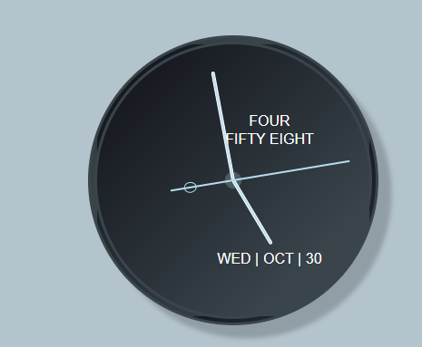

# 时间钟表-模拟时钟

### `JavaScript`

```javascript
// Getters
const getDomElements = () => {
  const hourDisplay = document.getElementById("hour-display");
  const minuteDisplay = document.getElementById("minute-display");
  const dayDisplay = document.getElementById("day-display");
  const monthDisplay = document.getElementById("month-display");
  const dateDisplay = document.getElementById("date-display");
  const hourHand = document.getElementById("hour-hand");
  const minuteHand = document.getElementById("minute-hand");
  const secondHand = document.getElementById("second-hand");

  return {
    hourDisplay,
    minuteDisplay,
    dayDisplay,
    monthDisplay,
    dateDisplay,
    hourHand,
    minuteHand,
    secondHand };

};

let getCurrentTime = () => {
  let date = new Date();
  let time = date.getTime();
  let hours = date.getHours();
  let minutes = date.getMinutes();
  let seconds = date.getSeconds();
  let milliseconds = date.getMilliseconds();

  return {
    date,
    time,
    // Adjust hours to 12 hour clock
    hours: hours > 12 ? hours - 12 : hours,
    minutes,
    seconds,
    milliseconds };

};

// Setters
const setTimeString = timeUnit => {
  // String representations of time numbers
  const timeStrings = {
    0: "",
    1: "one",
    2: "two",
    3: "three",
    4: "four",
    5: "five",
    6: "six",
    7: "seven",
    8: "eight",
    9: "nine",
    10: "ten",
    11: "eleven",
    12: "twelve",
    13: "thirteen",
    14: "fourteen",
    15: "fifteen",
    16: "sixteen",
    17: "seventeen",
    18: "eighteen",
    19: "nineteen",
    20: "twenty",
    30: "thirty",
    40: "fourty",
    50: "fifty",
    60: "sixty" };


  if (timeUnit < 20) {
    return `${timeStrings[timeUnit]}`;
  } else {
    let digitOne = timeStrings[Math.floor(timeUnit / 10) * 10];
    let digitTwo = timeStrings[timeUnit % 10] ? timeStrings[timeUnit % 10] : 0;
    if (digitTwo !== 0) {
      return `${digitOne} ${digitTwo}`;
    } else {
      return `${digitOne}`;
    }
  }
};

const setDateDisplay = currentTime => {
  let daySlice = currentTime.toDateString().slice(0, 3);
  let monthSlice = currentTime.toDateString().slice(4, 7);
  let dateSlice = currentTime.toDateString().slice(8, 10);

  return {
    daySlice,
    monthSlice,
    dateSlice };

};

// Rendering
let rotateHand = (timeUnit, factor, hand) => {
  // -90 degress accomodates for initial css layout position
  let position = timeUnit * factor - 90;
  hand.style.transform = `rotate(${position}deg`;
};

let run = () => {
  setInterval(() => {
    let domElements = getDomElements();
    let currentTime = getCurrentTime();
    // Hand values for animation
    // Seconds, minutes, hours reflect 100ms setInterval() iteration
    let seconds =
    (currentTime.seconds * 1000 + currentTime.milliseconds) / 1000;
    let minutes = (currentTime.minutes * 60 + seconds) / 60;
    let hours = (currentTime.hours * 60 + minutes) / 60;

    // Display strings for long-form readout
    let hourString = setTimeString(currentTime.hours);
    let minuteString = setTimeString(currentTime.minutes);
    let dayString = setDateDisplay(currentTime.date).daySlice;
    let monthString = setDateDisplay(currentTime.date).monthSlice;
    let dateString = setDateDisplay(currentTime.date).dateSlice;

    // Populate DOM Elements
    domElements.hourDisplay.innerHTML = `${hourString}`;
    domElements.minuteDisplay.innerHTML = `${minuteString}`;
    domElements.dayDisplay.innerHTML = `${dayString} | `;
    domElements.monthDisplay.innerHTML = `${monthString} | `;
    domElements.dateDisplay.innerHTML = `${dateString}`;

    // Rotate Hands
    rotateHand(seconds, 6, domElements.secondHand);
    rotateHand(minutes, 6, domElements.minuteHand);
    rotateHand(hours, 30, domElements.hourHand);
  }, 100);
};

run();
```

### `CSS`

```css
main {
  display: grid;
  grid-template-areas: "l t r" "l content r" "l b r";
  grid-template-columns: 1fr max-content 1fr;
  grid-template-rows: 1fr max-content 1fr;
  width: 100vw;
  height: 100vh;
  background: #b4c4cc;
}

#clock {
  position: relative;
  grid-area: content;
  width: 300px;
  height: 300px;
  border-radius: 50%;
  border: double 10px #39454b;
  background: linear-gradient(-45deg, #39454b 20%, #101017);
  box-shadow: 15px 15px 5px #919ea5;
}

.dial {
  position: absolute;
  top: calc(50% - 10px);
  left: calc(50% - 10px);
  width: 20px;
  height: 20px;
  box-sizing: border-box;
  border-radius: 50%;
  border: dotted 1px #101017;
  background: #4c5c64;
  z-index: 1;
}

/* Clock hands */
.hand {
  position: absolute;
  transform-origin: 0px center;
  /* Fix aliasing caused by transform: rotate() */
  outline: 1px solid transparent;
}

#hour-hand {
  /* center hand */
  top: calc(50% - 2px);
  left: 50%;
  width: 80px;
  height: 2px;
  border: 1px solid #fff;
  border-radius: 3px;
  background: #b7ddf0;
  z-index: 2;
}

#minute-hand {
  /* center hand */
  top: calc(50% - 2px);
  left: 50%;
  width: 120px;
  height: 2px;
  border: 1px solid #fff;
  border-radius: 3px;
  background: #b7ddf0;
  z-index: 3;
}

#second-hand {
  /* center hand */
  top: calc(50% - 1px);
  left: 80px;
  width: 200px;
  height: 2px;
  border-radius: 1px;
  background: #b7ddf0;
  transform-origin: 70px center;
  z-index: 5;
}

#second-hand .ring {
  width: 12px;
  height: 10px;
  margin-top: -5px;
  margin-left: 15px;
  background: transparent;
  border: 1px solid #b7ddf0;
  border-radius: 50%;
  z-index: 11;
}

/* Long form text displays */
.display-text li {
  list-style-type: none;
  font-size: 16px;
  line-height: 20px;
  font-family: Arial, Helvetica, sans-serif;
  text-transform: uppercase;
  color: #fff;
}

#time-display {
  position: absolute;
  top: 25%;
  left: calc(50% - 75px);
  min-width: 150px;
  margin: 0;
  text-align: center;
  transition: 1s ease-in;
}

#time-display li {
  display: block;
}

#calendar-display {
  position: absolute;
  top: 75%;
  left: calc(50% - 75px);
  min-width: 150px;
  margin: 0;
  text-align: center;
}

#calendar-display li {
  display: inline-block;
}

```

### `HTML`

```html
<main>
  <div id="clock">
    <div class="dial"></div>
    <ul id="time-display" class="display-text">
      <li id="hour-display"></li>
      <li id="minute-display"></li>
    </ul>
    <ul id="calendar-display" class="display-text">
      <li id="day-display"></li>
      <li id="month-display"></li>
      <li id="date-display"></li>
    </ul>
    <div id="second-hand" class="hand">
      <div class="ring"></div>
    </div>
    <div id="minute-hand" class="hand"></div>
    <div id="hour-hand" class="hand"></div>
  </div>
</main>
```

### 效果



### 注意

以上的钟表文字可替换

