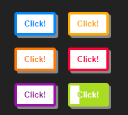

# 纯CSS感知方向渲染颜色

### `CSS`

```css
* {
  box-sizing: border-box;
}
body {
  background-color: #fff;
  text-align: center;
  font-family: 'HelveticaNeue-Light', 'Helvetica Neue Light', 'Helvetica Neue', Helvetica, Arial, 'Lucida Grande', sans-serif;
  min-height: 100vh;
  display: flex;
  align-items: center;
  justify-content: center;background-color: #222;
}
.container {
  display: grid;
  grid-template-columns: 1fr 1fr;
  grid-gap: 20px;
}
button {
  --borderWidth: 4;
  --paddingX: 8;
  --paddingY: 12;
  --transition: 0.25;
  background: var(--bg, #fff);
  border: calc(var(--borderWidth) * 1px) solid var(--color, #f0f);
  border-radius: calc(var(--borderWidth) * 1px);
  color: var(--color, #f0f);
  box-shadow: calc(var(--borderWidth) * 1px) calc(var(--borderWidth) * 1px) 0 #888;
  cursor: pointer;
  font-weight: bold;
  outline: transparent;
  padding: calc(var(--paddingX) * 1px) calc(var(--paddingY) * 1px);
  position: relative;
  transition: box-shadow calc(var(--transition) * 0.5s) ease;
  -webkit-tap-highlight-color: transparent;
}
button:active {
  box-shadow: 0 0 0 #888;
}
button:hover: div:nth-child(5) {
  opacity: 1;
  transition: opacity calc(var(--transition) * 1s) calc(var(--transition) * 1s) steps(1);
}
button span {
  -webkit-clip-path: var(--clip);
  bottom: -4px;
  clip-path: var(--clip);
  left: -4px;
  opacity: 0.5;
  position: absolute;
  right: -4px;
  top: -4px;
  z-index: 2;
}
button span:nth-of-type(1) {
  --clip: polygon(0 0, 100% 0, 50% 50%);
}
button span:nth-of-type(2) {
  --clip: polygon(100% 0, 100% 100%, 50% 50%);
}
button span:nth-of-type(3) {
  --clip: polygon(0 100%, 100% 100%, 50% 50%);
}
button span:nth-of-type(4) {
  --clip: polygon(0 0, 0 100%, 50% 50%);
}
button span:nth-of-type(1):hover,
button span:nth-of-type(2):hover,
button span:nth-of-type(3):hover,
button span:nth-of-type(4):hover {
  --clip: polygon(0 0, 100% 0, 100% 100%, 0 100%);
  z-index: 3;
}
button span:nth-of-type(1):hover ~ div:nth-of-type(1),
button span:nth-of-type(2):hover ~ div:nth-of-type(2),
button span:nth-of-type(3):hover ~ div:nth-of-type(3),
button span:nth-of-type(4):hover ~ div:nth-of-type(4) {
  --clip: inset(-5% -5% -5% -5%);
}
button div {
  -webkit-clip-path: var(--clip);
  background: var(--color, #f0f);
  border: calc(var(--borderWidth) * 1px) solid var(--color, #f0f);
  border-radius: calc(var(--borderWidth) * 1px);
  bottom: calc(var(--borderWidth) * -1px);
  clip-path: var(--clip);
  color: var(--bg, #fff);
  left: calc(var(--borderWidth) * -1px);
  padding: calc(var(--paddingX) * 1px) calc(var(--paddingY) * 1px);
  position: absolute;
  right: calc(var(--borderWidth) * -1px);
  top: calc(var(--borderWidth) * -1px);
  transition: clip-path calc(var(--transition) * 1s) ease, -webkit-clip-path calc(var(--transition) * 1s) ease;
}
button div:nth-of-type(1) {
  --clip: inset(-5% -5% 110% -5%);
}
button div:nth-of-type(2) {
  --clip: inset(-5% -5% -5% 110%);
}
button div:nth-of-type(3) {
  --clip: inset(110% -5% -5% -5%);
}
button div:nth-of-type(4) {
  --clip: inset(-5% 110% -5% -5%);
}
button div:nth-of-type(5) {
  bottom: 0;
  left: 0;
  opacity: 0;
  right: 0;
  top: 0;
}

```

### `HTML`

```html
<div class="container">
  <button role="button" tabindex="0" style="--color: #0088FF;">Click!<span></span><span></span><span></span><span></span>
    <div aria-hidden="true">Click!</div>
    <div aria-hidden="true">Click!</div>
    <div aria-hidden="true">Click!</div>
    <div aria-hidden="true">Click!</div>
    <div aria-hidden="true">Click!</div>
  </button>
  <button role="button" tabindex="0" style="--color: #FFAA00;">Click!<span></span><span></span><span></span><span></span>
    <div aria-hidden="true">Click!</div>
    <div aria-hidden="true">Click!</div>
    <div aria-hidden="true">Click!</div>
    <div aria-hidden="true">Click!</div>
    <div aria-hidden="true">Click!</div>
  </button>
  <button role="button" tabindex="0" style="--color: #FF7700;">Click!<span></span><span></span><span></span><span></span>
    <div aria-hidden="true">Click!</div>
    <div aria-hidden="true">Click!</div>
    <div aria-hidden="true">Click!</div>
    <div aria-hidden="true">Click!</div>
    <div aria-hidden="true">Click!</div>
  </button>
  <button role="button" tabindex="0" style="--color: #FF0033;">Click!<span></span><span></span><span></span><span></span>
    <div aria-hidden="true">Click!</div>
    <div aria-hidden="true">Click!</div>
    <div aria-hidden="true">Click!</div>
    <div aria-hidden="true">Click!</div>
    <div aria-hidden="true">Click!</div>
  </button>
  <button role="button" tabindex="0" style="--color: #9911AA;">Click!<span></span><span></span><span></span><span></span>
    <div aria-hidden="true">Click!</div>
    <div aria-hidden="true">Click!</div>
    <div aria-hidden="true">Click!</div>
    <div aria-hidden="true">Click!</div>
    <div aria-hidden="true">Click!</div>
  </button>
  <button role="button" tabindex="0" style="--color: #AADD22;">Click!<span></span><span></span><span></span><span></span>
    <div aria-hidden="true">Click!</div>
    <div aria-hidden="true">Click!</div>
    <div aria-hidden="true">Click!</div>
    <div aria-hidden="true">Click!</div>
    <div aria-hidden="true">Click!</div>
  </button>
</div>
```

### 效果

