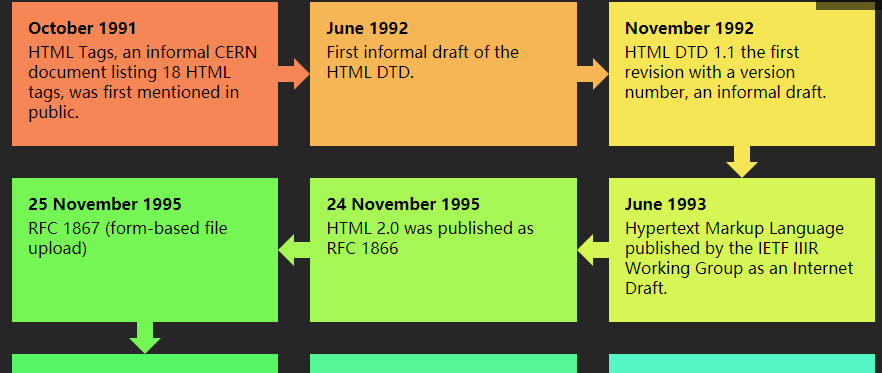

#  纯CSS时间表

### `CSS`

```css
:root {
  font-family: sans-serif;
}
body {
    background-color: #262626;
}
ol {
  margin: 0;
  list-style: none;
  padding: 0;
  --hue: 1;
  --unit: 1rem;
}
h1 {
  text-align: center;
}
p {
  line-height: 1.3;
}
.event-date {
  margin: 0 0 0.25rem;
  font-weight: bold;
}
.event-description {
  margin: 0;
}
li {
  --height: 7rem;
  position: relative;
  display: block;
  background-color: hsl(calc(var(--hue)*360/20),90%,65%);
  border-color: hsl(calc(var(--hue)*360/20),90%,65%);
  padding: 1rem;
  margin: 2rem 0;
}
li::before {
  content: "";
  background-color: inherit;
  position: absolute;
  display: block;
  width: var(--unit);
  height: var(--unit);
  top: 100%;
  left: calc(50% - (var(--unit)/2));
}
li::after {
  content: "";
  position: absolute;
  display: block;
  top: calc(100% + var(--unit));
  left: calc(50% - (var(--unit)));
  border: var(--unit) solid transparent;
  border-top-color: inherit;
}
li:last-child::before,
li:last-child::after {
  content: none;
}
li:nth-child(20n+1){
  --hue: 1;
}
li:nth-child(20n+2){
  --hue: 2;
}
li:nth-child(20n+3){
  --hue: 3;
}
li:nth-child(20n+4){
  --hue: 4;
}
li:nth-child(20n+5){
  --hue: 5;
}
li:nth-child(20n+6){
  --hue: 6;
}
li:nth-child(20n+7){
  --hue: 7;
}
li:nth-child(20n+8){
  --hue: 8;
}
li:nth-child(20n+9){
  --hue: 9;
}
li:nth-child(20n+10){
  --hue: 10;
}
li:nth-child(20n+11){
  --hue: 11;
}
li:nth-child(20n+12){
  --hue: 12;
}
li:nth-child(20n+13){
  --hue: 13;
}
li:nth-child(20n+14){
  --hue: 14;
}
li:nth-child(20n+15){
  --hue: 15;
}
li:nth-child(20n+16){
  --hue: 16;
}
li:nth-child(20n+17){
  --hue: 17;
}
li:nth-child(20n+18){
  --hue: 18;
}
li:nth-child(20n+19){
  --hue: 19;
}
li:nth-child(20n+20){
  --hue: 20;
}
@media (min-width: 550px) and (max-width: 899px){
  li {
    margin: 1rem;
    width: calc(50% - 4rem);
    float: left;
    min-height: var(--height);
  }
  li:nth-child(4n+3),
  li:nth-child(4n+4) {
    float: right;
  }
  li:nth-child(4n+1)::before {
    top: calc(var(--height)/2 + var(--unit)/2);
    left: 100%;
  }
  li:nth-child(4n+1)::after {
    top: calc(var(--height)/2);
    left: calc(100% + (var(--unit)));
    border: var(--unit) solid transparent;
    border-left-color: inherit;
  }
  li:nth-child(4n+3)::before {
    top: calc(var(--height)/2 + var(--unit)/2);
    left: -1rem;
  }
  li:nth-child(4n+3)::after {
    top: calc(var(--height)/2);
    left: -3rem;
    border: var(--unit) solid transparent;
    border-right-color: inherit;
  }
}
@media (min-width: 900px) and (max-width: 1199px){
  li {
    margin: 1rem;
    width: calc(33.33% - 4rem);
    float: left;
    min-height: 7rem;
  }
  li:nth-child(6n+4),
  li:nth-child(6n+5),
  li:nth-child(6n+6) {
    float: right;
  }
  li:nth-child(6n+1)::before,
  li:nth-child(6n+2)::before {
    top: calc(var(--height)/2 + var(--unit)/2);
    left: 100%;
  }
  li:nth-child(6n+1)::after,
  li:nth-child(6n+2)::after {
    top: 3.5rem;
    left: calc(100% + (var(--unit)));
    border: var(--unit) solid transparent;
    border-left-color: inherit;
  }
  li:nth-child(6n+4)::before,
  li:nth-child(6n+5)::before{
    top: calc(var(--height)/2 + var(--unit)/2);
    left: -1rem;
  }
  li:nth-child(6n+4)::after,
  li:nth-child(6n+5)::after{
    top: calc(var(--height)/2);
    left: -3rem;
    border: var(--unit) solid transparent;
    border-right-color: inherit;
  }
}
@media (min-width: 1200px){
  ol {
    max-width: 1600px;
    margin: 0 auto;
  }
  li {
    margin: 1rem;
    width: calc(25% - 4rem);
    float: left;
    min-height: 7rem;
  }
  li:nth-child(8n+5),
  li:nth-child(8n+6),
  li:nth-child(8n+7),
  li:nth-child(8n+8){
    float: right;
  }
  li:nth-child(8n+1)::before,
  li:nth-child(8n+2)::before,
  li:nth-child(8n+3)::before{
    top: calc(var(--height)/2 + var(--unit)/2);
    left: 100%;
  }
  li:nth-child(8n+1)::after,
  li:nth-child(8n+2)::after,
  li:nth-child(8n+3)::after{
    top: calc(var(--height)/2);
    left: calc(100% + (var(--unit)));
    border: var(--unit) solid transparent;
    border-left-color: inherit;
  }
  li:nth-child(8n+5)::before,
  li:nth-child(8n+6)::before,
  li:nth-child(8n+7)::before {
    top: calc(var(--height)/2 + var(--unit)/2);
    left: -1rem;
  }
  li:nth-child(8n+5)::after,
  li:nth-child(8n+6)::after,
  li:nth-child(8n+7)::after {
    top: calc(var(--height)/2);
    left: -3rem;
    border: var(--unit) solid transparent;
    border-right-color: inherit;
  }
}
```

### `HTML`

```html
<!-- Takes an ordered list and renders a responsive timeline try resizing the viewport -->
<h1>Timeline of HTML</h1>
<ol>
    <li>
        <p class="event-date">October 1991</p>
        <p class="event-description">HTML Tags, an informal CERN document listing 18 HTML tags, was first mentioned in public.</p>
    </li>
    <li>
        <p class="event-date">June 1992</p>
        <p class="event-description">First informal draft of the HTML DTD.</p>
    </li>
    <li>
        <p class="event-date">November 1992</p>
        <p class="event-description">HTML DTD 1.1 the first revision with a version number, an informal draft.</p>
    </li>
    <li>
        <p class="event-date">June 1993</p>
        <p class="event-description">Hypertext Markup Language published by the IETF IIIR Working Group as an Internet Draft. </p>
    </li>
    <li>
        <p class="event-date">24 November 1995</p>
        <p class="event-description">HTML 2.0 was published as RFC 1866</p>
    </li>
    <li>
        <p class="event-date">25 November 1995</p>
        <p class="event-description">RFC 1867 (form-based file upload)</p>
    </li>
    <li>
        <p class="event-date">May 1996</p>
        <p class="event-description">RFC 1942 (tables)</p>
    </li>
    <li>
        <p class="event-date">August 1996</p>
        <p class="event-description">RFC 1980 (client-side image maps)</p>
    </li>
    <li>
        <p class="event-date">January 1997</p>
        <p class="event-description">RFC 2070 (internationalization)</p>
    </li>
    <li>
        <p class="event-date">14 January 1997</p>
        <p class="event-description">HTML 3.2 was published as a W3C Recommendation.</p>
    </li>
    <li>
        <p class="event-date">18 December 1997</p>
        <p class="event-description">HTML 4.0 was published as a W3C Recommendation.</p>
    </li>
    <li>
        <p class="event-date">24 April 1998</p>
        <p class="event-description">HTML 4.0 was reissued with minor edits</p>
    </li>
    <li>
        <p class="event-date">24 December 1999</p>
        <p class="event-description">HTML 4.01 was published as a W3C Recommendation</p>
    </li>
    <li>
        <p class="event-date">26 January 2000</p>
        <p class="event-description">XHTML 1.0 was published as a W3C Recommendation</p>
    </li>
    <li>
        <p class="event-date">May 2000</p>
        <p class="event-description">"ISO HTML", based on HTML 4.01 Strict was published as an ISO/IEC international standard.</p>
    </li>
    <li>
        <p class="event-date">31 May 2001</p>
        <p class="event-description">XHTML 1.1 was published as a W3C Recommendation.</p>
    </li>
    <li>
        <p class="event-date">28 October 2014</p>
        <p class="event-description">HTML5 was published as a W3C Recommendation.</p>
    </li>
    <li>
        <p class="event-date">1 November 2016</p>
        <p class="event-description">HTML 5.1 was published as a W3C Recommendation.</p>
    </li>
    <li>
        <p class="event-date">14 December 2017</p>
        <p class="event-description">HTML 5.2 was published as a W3C Recommendation.</p>
    </li>
</ol>
```

### 效果



### 注意

直接添加`li`标签就可以增加节点