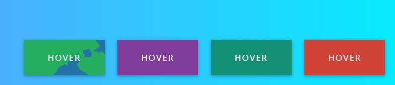

# 纯CSS流动悬停样式

### `CSS`

```css
:root {
  --height: 100px;
  --width: 200px;
}

* {
  margin: 0;
  padding: 0;
  box-sizing: border-box;
}

body {
  width: 100%;
  height: 100vh;
  background-image: linear-gradient(to right, #4facfe 0%, #00f2fe 100%);
  overflow: hidden;
  display: flex;
  justify-content: center;
  align-items: center;
  font-family: sans-serif;
}

.wrapper {
  width: calc(4 * var(--width));
  height: calc(4 * var(--height));
  display: flex;
  justify-content: center;
  align-items: center;
}

.button {
  position: relative;
  width: calc(0.8 * var(--width));
  height: calc(0.7 * var(--height));
  display: flex;
  justify-content: center;
  align-items: center;
  cursor: pointer;
  overflow: hidden;
  margin: 0 0.8rem;
  box-shadow: 0 2px 5px rgba(0, 0, 0, 0.2), 0 3px 8px rgba(0, 0, 0, 0.1);
  transition: all 0.3s cubic-bezier(0, 0.22, 0.3, 1);
}
.button:before {
  content: '';
  position: absolute;
  top: 0;
  left: 0;
  right: 0;
  bottom: 0;
  background: rgba(0, 0, 0, 0.1);
}
.button span {
  color: #fff;
  font-size: 1rem;
  z-index: 10;
  text-transform: uppercase;
  letter-spacing: 2px;
}
.button._1 {
  background: #2980b9;
}
.button._2 {
  background: #8e44ad;
}
.button._3 {
  background: #16a085;
}
.button._4 {
  background: #e74c3c;
}
.button .back {
  position: absolute;
  width: 0;
  height: 0;
  filter: url(#filter);
  border-radius: 50%;
  z-index: 5;
  transition: all 2.5s cubic-bezier(0.1, 0.22, 0.3, 1);
}
.button._1 .back {
  left: -50%;
  top: -50%;
  background: #27ae60;
}
.button._2 .back {
  right: -50%;
  top: -50%;
  background: #c0392b;
}
.button._3 .back {
  left: -50%;
  bottom: -50%;
  background: #34495e;
}
.button._4 .back {
  right: -50%;
  bottom: -50%;
  background: #2980b9;
}
.button:hover .back {
  width: calc(2 * var(--width));
  height: calc(2 * var(--height));
}

@media only screen and (max-width: 750px) {
  .wrapper {
    flex-direction: column;
  }

  .button {
    margin: 0.8rem 0;
  }
}
.support {
  position: absolute;
  right: 10px;
  bottom: 10px;
  padding: 10px;
  display: flex;
}

a {
  margin: 0 20px;
  color: #fff;
  font-size: 2rem;
  transition: all 400ms ease;
}

a:hover {
  color: #222;
}

```

### `HTML`

```html
<svg width="0" height="0"> 
	<filter id="filter">
		<feTurbulence type="fractalNoise" baseFrequency=".01" numOctaves="6" />
		<feDisplacementMap in="SourceGraphic" scale="100" />
	</filter>
</svg>


<div class="wrapper">
	<div class="button _1">
		<span>hover</span><div class="back"></div>
	</div>
	<div class="button _2">
		<span>hover</span><div class="back"></div>
	</div>
	<div class="button _3">
		<span>hover</span><div class="back"></div>
	</div>
	<div class="button _4">
		<span>hover</span><div class="back"></div>
	</div>
</div>


```

### 效果



