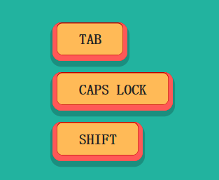

# 纯CSS键盘键按钮样式

### `CSS`

```CSS
body {
  background-color: #22B39F;
}

.c-buttons {
  display: flex;
  flex-direction: column;
  align-items: flex-start;
  just-content: flex-start;
  width: 450px;
  margin: 3rem auto;
}

.o-btn {
  position: relative;
  display: block;
  margin: 0.5rem 0;
  padding: 0.6em 1.8em 0.9em;
  border: none;
  background-color: #FFBA57;
  font-family: monospace;
  font-size: 1.6rem;
  font-weight: bold;
  text-transform: uppercase;
  color: #222;
  box-shadow: inset 0.1em -0.2em 0 4px #FF5857, inset -0.1em -0.2em 0 4px #FF5857, inset 0.08em -0.18em 0 5px #bd0100, inset -0.08em -0.18em 0 5px #bd0100, 0 0.25em 0 0.15em rgba(0, 0, 0, 0.2);
  border-radius: 0.8rem;
  overflow: hidden;
  transition: all 90ms ease-in-out;
}
.o-btn:active {
  padding: 0.7em 1.8em 0.8em;
  box-shadow: inset 0.05em -0.15em 0 4px #FF5857, inset -0.05em -0.15em 0 4px #FF5857, inset 0.03em -0.13em 0 5px #bd0100, inset -0.03em -0.13em 0 5px #bd0100, 0 0.25em 0 0.15em rgba(0, 0, 0, 0.2);
  outline: none;
}
.o-btn:focus {
  outline: none;
}

```

### `HTML`

```html
<div class="c-buttons"> 
  <button class="o-btn">Tab</button> 
  <button class="o-btn">Caps Lock</button> 
  <button class="o-btn">Shift</button> 
</div>

```

### 效果

