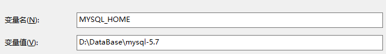
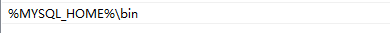
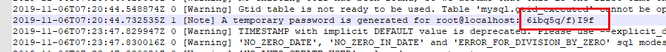

# 命令行安装

### 第一步解压安装包,并配置bin目录

1. 
2. 

### 初始化安装

1. 创建`my.ini`文件

   ```shell
   [mysqld] 
   port = 3306 
   basedir=D:\DataBase\mysql-5.7
   datadir=D:\DataBase\mysql-5.7\data 
   max_connections=200 
   character-set-server=utf8 
   default-storage-engine=INNODB 
   sql_mode=NO_ENGINE_SUBSTITUTION,STRICT_TRANS_TABLES 
   [mysql] 
   default-character-set=utf8
   ```

2. 使用命令初始化,自动创建`data`文件夹

   ```shell
   # 自动生成data目录
   mysqld --initialize
   ```

   

### 执行安装命令,并启动服务

```shell
# 安装
mysqld -install

#启动服务
net start mysql
```

### 链接`mysql`,并修改密码

1. 使用`root`身份登录`mysql`,该初始化密码在`data\xxx.err`文件中,搜索`A temporary password is generated for root@localhost: `后面的则是密码.
   

2. 修改密码

   ```shell
   #登录,XXX为密码
   mysql -uroot -pXXX
   
   #重设密码
   set password = password(`root`);
   ```

   